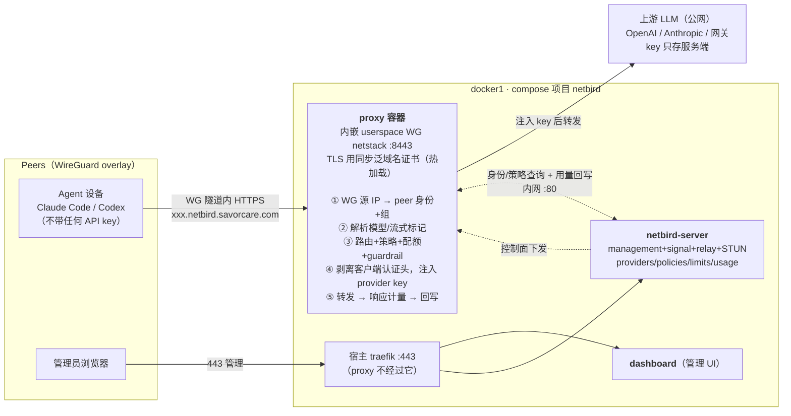

# netbird 分支

NetBird 全功能自建（VPN 管理 + **Agent Network** Beta），目标主机 docker1，
对外地址 `https://netbird.savorcare.com`。

上游没有静态 compose 文件：官方安装入口是交互式脚本 `getting-started.sh`
（内嵌 Dex IdP，无需外部 IdP）。本分支的上游产物由 main 的 `sync-netbird.yml`
在 Action 里 **source 脚本、只调渲染函数（不部署）** 生成：

- 第一次渲染（`REVERSE_PROXY_TYPE=1`，外部 traefik）→ `docker-compose.upstream.yaml`
  （dashboard + netbird-server，标签自带 docker1 固定证书风格 `tls=true`）
- 第二次渲染（`REVERSE_PROXY_TYPE=0` + `ENABLE_PROXY=true`）→ 从中提取 proxy 服务
  → `docker-compose.upstream-proxy.yaml`（proxy 定义始终跟踪上游，非手抄）

## 文件分工

| 文件 | 用途 | 谁来改 |
|---|---|---|
| `docker-compose.upstream.yaml` | 脚本 option 1 渲染原样产物 | 只由机器人改 |
| `docker-compose.upstream-proxy.yaml` | 脚本 option 0 渲染后提取的 proxy 片段 | 只由机器人改 |
| `docker-compose.portainer.yaml` | 全部自定义（mirror、密钥外置、agent network、traefik 补充标签） | **只手改这个** |
| `docker-compose.yaml` | 三文件预合并产物，3 个 netbirdio 镜像钉 digest | 只由机器人生成 |
| `config.yaml` | 渲染参考模板（3 个密钥已洗成 `__GENERATE_AT_DEPLOY__`） | 只由机器人改 |
| `dashboard.env` / `proxy.env` | 渲染参考件（token 为 `__SET_ME__` 占位） | 只由机器人改 |

## 平台项目 env（必填）

| 变量 | 说明 |
|---|---|
| `NB_PROXY_TOKEN` | proxy 注册到管理面的 token。首次部署先填占位值（proxy 起不来属预期），拿到真 token 后替换重建（见 bootstrap 第 5 步） |

其余配置全部内联在 compose 里（dashboard env 无密钥；config.yaml 走命名卷）。

## 首次 bootstrap（按序执行）

1. **DNS**：`netbird.savorcare.com` A 记录指向 docker1。
   （`*.netbird.savorcare.com` 公网泛解析当前不需要——agent network endpoint 只在
   overlay 内解析；仅当启用公网暴露回退方案时才需要，见末节。）
2. **证书**：OPNSense 证书申请需包含 `*.netbird.savorcare.com`，同步到 docker1
   `/opt/traefik/certs/savorcare.com/`（bind 进 proxy 的 `/wildcard-certs` 只读挂载）。
   **proxy 容器以 UID/GID 1000 运行（非 root）**，同步工具须设置：公钥/私钥权限
   `0440`、组 `1000`（owner 保持 root），否则容器读不到私钥。proxy 主证书即该目录的
   `fullchain.pem` + `key.pem`（certwatch 热加载，续期免介入；override 环境变量
   `NB_PROXY_CERTIFICATE_FILE/KEY_FILE` 钉死这两个文件名，同步工具改名要同步改）。
3. **端口预检**（docker1）：UDP 3478（STUN）、UDP 51820（proxy WG）未被占用：
   `ss -lunp | grep -E '3478|51820'` 应为空。
4. **生成真实 `config.yaml` 并灌入命名卷**：

   ```bash
   # 在 docker1 上，分支里的 config.yaml 模板复制一份后执行。
   # 注意分隔符必须用 |（base64 值可能含 /，用 / 做分隔符会导致 sed 静默失败）；
   # 字段锚定替换，幂等：
   sed -i "s|authSecret: \"[^\"]*\"|authSecret: \"$(openssl rand -base64 32 | tr -d '=')\"|" config.yaml
   sed -i "s|sessionCookieEncryptionKey: \"[^\"]*\"|sessionCookieEncryptionKey: \"$(openssl rand -base64 32)\"|" config.yaml
   sed -i "s|encryptionKey: \"[^\"]*\"|encryptionKey: \"$(openssl rand -base64 32)\"|" config.yaml
   # reverseProxy.trustedHTTPProxies：模板里的 172.30.0.10/32 是上游为
   # 内建 traefik 写的死值（docker1 上不存在此地址），替换为 docker1 traefik
   # 在 reverse-proxy 网络的源地址段。不处理则功能可用，但管理面日志/审计
   # 把所有客户端记成转发地址。
   sed -i "s|172.30.0.10/32|$(docker network inspect reverse-proxy -f '{{(index .IPAM.Config 0).Subnet}}')|" config.yaml
   # 如需 gRPC 侧同样收敛，另起一行新增 trustedPeers: 键（模板没有，手工添加）填同值段
   grep -c GENERATE config.yaml   # 必须为 0 再继续（server 对占位符会 FATL：
                                  # decode encryption key: illegal base64 data）
   docker volume create netbird_netbird_config
   docker run --rm -v netbird_netbird_config:/cfg -v "$PWD":/src alpine \
     sh -c "cp /src/config.yaml /cfg/config.yaml"
   ```
5. **Arcane 建项目**部署（compose 用本分支 `docker-compose.yaml`，项目 env 填
   `NB_PROXY_TOKEN=placeholder`）。待 netbird-server 正常后取真 token：

   ```bash
   docker exec netbird-server /go/bin/netbird-server admin token create \
     --name "default-proxy" --config /etc/netbird/config.yaml
   ```

   输出 `nbx_...` 填入项目 env `NB_PROXY_TOKEN`，重建项目（此前 proxy 起不来属预期）。
6. **建首个管理员**：浏览器开 `https://netbird.savorcare.com/setup`（仅无用户时可见）。

## Agent Network 验证

1. Dashboard 左侧应出现 **Agent Network** 菜单（Peers/DNS 等常规页面同时保留——
   本部署是完整面板，非 ONLY 模式）。
2. **Agent Network → Providers → Connect Provider**：填入 provider 密钥，
   保存后生成 tunnel-only endpoint（`*.netbird.savorcare.com` 形态）。
3. **Policies → Add Policy**：把 source group 关联到 provider（默认全拒）。
4. 测试设备连 NetBird 客户端后，在 overlay 内 curl endpoint 验证；
   **Usage & Logs** 应记录身份/模型/token/费用。
5. endpoint 证书由 proxy 容器从 `/wildcard-certs`（docker1 同步的泛域名证书）提供；
   若 TLS 报错先查该挂载路径与证书 SAN。

## 自定义摘要

- 镜像全部走 `jcr.savorcare.com/docker/netbirdio/*` mirror，3 个主镜像钉 digest
  （bot 每次 sync 重钉 latest）。
- traefik 标签为 docker1 固定证书风格（`tls=true`，无 certresolver），override 只补了
  web 入口 `http2https` 跳转一条。
- `./config.yaml` bind 挂载改为 `netbird_config` 命名卷（密钥不进 git，
  合并产物单文件可部署）。
- proxy 私有模式：`NB_PROXY_PRIVATE=true`、无 traefik 路由（`traefik.enable=false`）、
  ACME 关闭、PROXY protocol 关闭——agent 流量走 WireGuard 隧道直连 proxy，
  不经过 docker1 的 traefik。

## 回退方案：proxy 公网暴露（默认不启用）

仅当未来要用 proxy 的"向公网暴露内网资源"功能时：

1. override 给 proxy 加回 TCP passthrough 标签，`HostSNIRegexp` 收敛到
   `^.+\.netbird.savorcare.com$`（**不得**用上游的 `HostSNI(*)`，会接管共享 traefik
   上其他栈的 443 流量）；
2. proxy 开 `NB_PROXY_ACME_CERTIFICATES=true`（tls-alpn-01）或继续用静态证书；
3. 公网 DNS 加 `*.netbird.savorcare.com` 泛解析；
4. 需要保真实客户端 IP 时再上 PROXY protocol v2（宿主 traefik 加 file provider
   的 serversTransport 片段 + `NB_PROXY_PROXY_PROTOCOL=true`）。

## proxy 工作机制（Agent Network 数据面）



要点：**agent 流量全程在 WireGuard 隧道内，不经过 traefik 或任何公网入口**；
身份来自 WG peer 映射（隧道即凭证），endpoint 仅 overlay 内可达；
provider key 只存服务端，客户端永远拿不到（keyless）。
draw.io 可编辑源文件：[docs/proxy-architecture.drawio](docs/proxy-architecture.drawio)。

## 回滚

- sync 引入上游不兼容变更：workflow 哨兵会失败且不提交，线上不动。
- 已提交的坏变更：在本分支 revert 对应 sync commit，Arcane 重新同步。
  digest 历史都在 git 里。
- 关闭 Agent Network：`docker-compose.portainer.yaml` 删掉
  `NETBIRD_AGENT_NETWORK_ENABLED` 与 proxy 定制，等下次 sync 或直接手改
  `docker-compose.yaml` 重建（数据在 `netbird_*` 卷里，随时可加回）。
